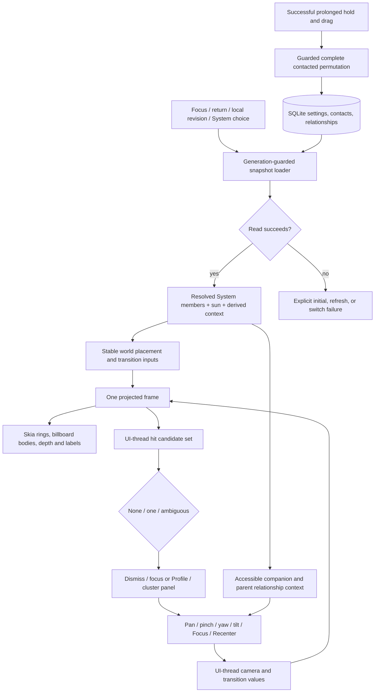

# Phase 29: Orrery Camera, Scale & Exploration — Research

**Researched:** 2026-09-06 (local date)
**Domain:** Local SQLite population resolution; Skia world projection; Reanimated/Gesture Handler camera interaction
**Confidence:** HIGH for opened application and installed-library code; MEDIUM for external documentation; physical-device behavior remains unmeasured.

<user_constraints>
## User Constraints (from CONTEXT.md)

The following decision/discretion/deferred text is copied verbatim. Corrections to stale descriptions of the baseline follow in the Summary; they do not change the decisions.

### Locked Decisions

### Ground truth and process
- **D-01:** Read the phase dossier (canonical_refs) IN FULL before planning. Where present, its dated "Amendment — audit resolutions 2026-09-01" section overrides older text. [DECIDED] and [REJECTED] items are settled: reopening one, or reversing any Accepted ADR or HANDOFF.md entry, is an owner decision — stop and ask, never "fix" it.
- **D-02:** Read the phase planning-notes file (canonical_refs) as a binding appendix: every REPLAN finding must be reflected in the plan, and every trip-wire is a stop-and-ask.
- **D-03:** This phase ships SQLite schema. Never assume a migration number — verify head+1 against `src/db/migrations/` and `TARGET_VERSION` in `src/db/database.ts` on disk at plan time (numbers drift every schema phase). Milestone order is schema → consumers → backup; the backup v4 bump is Phase 36's final plan. All new durable preferences are `app_settings` columns added to `PORTABLE_SETTINGS_KEYS`, never AsyncStorage.

### Phase-specific constraints
- **D-04:** One canonical Orrery view (E-03). The Status / Relationship mode split, its mode toggle, and the relationship-morph behavior are simplified *away*, not preserved because code exists — ADR-048 is superseded by ADR-077. Do not introduce a second Orrery mode to replace the removed one.
- **D-05:** Never-contacted bodies enter the All Contacts and Not Contacted Systems by **widening the read explicitly and by population** (E-02) — never by deleting the never-contacted exclusion from the default orrery read, or they leak into every view. They are placed at a fixed neutral resting angle with neutral styling and **no fabricated interval progress**; ADR-011 still forbids presenting a never-contacted contact as decaying.
- **D-06:** Orrery persistence today is only `sun_contact_id`, `self_sun_colour`, and `contacts.ring_seq` (R-05). Density preset, satellites toggle, and last-active System are new durable `app_settings` columns (portable via the backup manifest). This migration may be merged with Phase 30's Systems migration — decide the split once, explicitly.
- **D-07:** Camera state gets **no schema and no persistence** (R-05 trip-wire). It is restored only across `Orrery → Profile → Back` within a navigation session and returns to canonical Home on fresh launch or fresh Orrery visit.
- **D-08:** Reduced motion does not exist anywhere in `src/` (R-17). Consume Phase 23's hook, read it *from the Skia render loop* — never drive animation from React state — and pause on `useIsFocused === false` and `AppState` background. User-controlled pan/zoom/tilt/yaw stay available under Reduced Motion.
- **D-09:** Relationship Satellites depend on the Phase 24 relationships model (R-01/R-05 trip-wire). Do not plan them against an assumed table; verify the model exists on disk. Satellites get no status, Gravity, frequency, rails, System/Dashboard membership, logging, Profile, or satellites of their own.
- **D-10:** Do not hardcode Category names — Category CRUD and its deletion fallout are a STUB-CONTRACT to Phase 37. Performance claims for this phase cannot be made on the desktop emulator (Skia render loop); measure on the phone, and route density/neighbor tuning and large-System perf to the Phase 18-equivalent hardening phase.

### Claude's Discretion
- Everything the dossier marks [DERIVED], plus open implementation details that do not touch a [DECIDED] item, an ADR, or a HANDOFF.md entry.

### Deferred Ideas

See the dossier's [DEFERRED] and out-of-scope sections — they are boundaries, not gaps; do not plan them. Specifically do NOT build: custom System authoring (create/rename/edit/delete, predicates, manual membership, previews) — that is the sibling Orrery Systems phase; the polished spin/shedding/capture System-switch animation (a simple functional transition suffices here); unrestricted true-3D/free-flight or below-plane camera movement; and any contact-to-contact social-graph or speculative graph schema (`contact_level`, graph-parent, moon-owner).
</user_constraints>

## Summary

**Primary recommendation:** Separate the current screen into a coherent System snapshot, pure world/projection functions, UI-thread camera/gesture state, and conventional accessible overlays. Keep the existing native stack, status engine, photo pipeline, transaction primitive, and Skia renderer. Use animated sibling `Group` depth ordering; a new 3D engine or per-frame React tree reorder is unnecessary. [VERIFIED: src/screens/OrreryScreen.tsx:314-448; node_modules/@shopify/react-native-skia/src/sksg/Container.native.ts:42-65; node_modules/@shopify/react-native-skia/cpp/api/recorder/RNRecorder.h:44-89]

The largest correctness change is replacing the knowingly approximate endpoint hit map. The current screen computes two placement endpoints and hit-tests the selected endpoint while the body can still be interpolating. The new render and gesture paths must consume the same projected, interpolated frame throughout camera motion, density changes, focus/recenter, and membership transitions. The existing viewport-clamped geometry must also become world geometry independent of viewport size. [VERIFIED: src/screens/OrreryScreen.tsx:314-448; src/logic/orrery-geometry-logic.ts:135-181,249-275]

**Baseline corrections required in plans:** Reduced Motion already exists and is consumed by both canvas and sun; structured relationships already exist. SQLite currently declares `TARGET_VERSION = 20` and registers through `migration020`, so the next migration is 21 **only if that remains head at execution**. Portable backup already declares `BACKUP_FORMAT_VERSION = 4`; the old “Phase 36 v4” wording is stale, while the Phase 36 ownership of coordinated wire emission remains binding. [VERIFIED: src/theme/use-reduced-motion.ts:61-132; src/components/orrery/OrreryCanvas.tsx:101-115; src/components/orrery/SunBody.tsx:87-111; src/db/migrations/016-contact-knowledge.ts:30-45; src/db/database.ts:55-79; src/backup/types.ts:14-16; src/backup/backup-schema.ts:155-173]

## Project Constraints (from AGENTS.md)

- Read HANDOFF first; preserve DECIDED/REJECTED entries and accepted ADRs. Taste, product, risk/security posture and decision reversals belong to the owner. Plan splits, enforcement of existing decisions and delegated implementation details belong to the planner. [VERIFIED: AGENTS.md:7-30]
- Never push, including tools with push side effects; never create a worktree or change branches for this work. Preserve other agents' edits. Read full affected subsystem files and every shared-table writer, not just a diff. [VERIFIED: AGENTS.md:32-66]
- Keep all contact reads local and offline; add no backend, telemetry or network read path. Do not widen AI egress. [VERIFIED: AGENTS.md:63-81]
- Ship additive, forward-only application migrations; never modify shipped steps. Use DAOs and the shared transaction boundary, not SQL in components. Preserve normalized raw-TEXT custom fields and all associated history/type invariants. [VERIFIED: AGENTS.md:71-97,147-149; src/db/transaction.ts:11-28]
- TypeScript, Zustand, Biome, theme tokens throughout; no literal colors in Skia. No per-frame React state. Pause animation on blur/background; keep tunables centralized. Use local-date helpers and preserve portrait locking. [VERIFIED: AGENTS.md:145-155]
- Graph is discovery only: use `npm run graph:ask -- governs ...` first, distinguish EXTRACTED from INFERRED, and manually search SQL writers. Only `npm run graph:build` may rebuild; no rebuild was needed. ADRs are immutable; living system docs require changelog updates. [VERIFIED: AGENTS.md:159-162,172-216]
- No device action is needed for planning. Before first device use the owner must confirm Orbit package and Metro session; use the approved adb tooling. Only physical-phone measurements can substantiate Orrery performance. [VERIFIED: AGENTS.md:225-265]

## Architectural Responsibility Map

The following ownership split is a design recommendation grounded in the current DAO/service/component boundaries. [VERIFIED: src/db/orrery-read.ts:56-103; src/services/impact.ts:88-101; src/components/orrery/OrreryCanvas.tsx:97-166]

| Capability | Primary owner | Secondary owner | Responsibility |
|---|---|---|---|
| System membership and categories | SQLite read layer | Pure System resolver | Bound/archive/never-contacted predicates; stable IDs; coherent snapshot |
| Status and Gravity | Existing domain logic | Batched read adapter | Reuse canonical derivation; no stored scores |
| Density/satellites/last System | Settings DAO and SQLite | In-memory preference controller | Validate, hydrate, serialize writes, expose recoverable failures |
| World placement | Pure logic | Snapshot assembly | Rank, timestamp angle, bounded drift, deterministic nudges |
| Projection and hit targets | UI-thread derived frame | Pure tested mathematics | One coordinate convention and one current-frame result |
| Camera and gesture arbitration | Reanimated/Gesture Handler | Pure intent/controller helpers | Transient pose, arbitration, cancellation, deliberate reorder |
| Bodies/labels/depth | Skia | Existing local photo/font resources | Billboard rendering; native sibling depth order |
| Companion/cluster/HUD | React Native | Shell transient lifecycle | Accessible actions, measured exclusions, focus restoration |
| Durable rank mutation | Ring DAO | Pure filtered permutation | Complete guarded contacted population; atomic rollback |

## Standard Stack

Retain the installed stack. Quoted package/version declarations below are from the opened package manifest; resolved installed versions were independently checked with `npm ls`. These are existing dependencies, not installation recommendations. [VERIFIED: package.json:10-45,48-55]

| Existing dependency | Observed version | Use |
|---|---|---|
| `"@shopify/react-native-skia": "2.6.2"` | 2.6.2 | Canvas, Groups, paths, local image/font rendering |
| `"react-native-reanimated": "4.5.1"` | 4.5.1 | Shared pose/frame values; timing/decay/cancellation |
| `"react-native-gesture-handler": "~2.32.0"` | 2.32.0 | Existing Gesture builders and native recognizers |
| `"expo": "~57.0.13"`, `"react-native": "0.86.2"`, `"react": "19.2.3"` | 57.0.13 / 0.86.2 / 19.2.3 | Existing runtime |
| `"expo-sqlite": "~57.0.1"` | 57.0.1 | Durable preferences and local reads |
| `"zustand": "^5.0.15"` | Existing v5 dependency | Preference/session and shell state |
| `"vitest": "^4.1.10"` | 4.1.10 | Pure and real-SQL integration tests |

The npm registry confirmed the three camera-library versions and their publication timestamps: Skia 2.6.2, 2026-04-04; Reanimated 4.5.1, 2026-07-02; Gesture Handler 2.32.0, 2026-06-11. These checks confirm the installed baseline, not a recommendation to update to registry latest. [VERIFIED: npm view exact-version and time queries, 2026-09-06]

**Installation:** None. **Package Legitimacy Audit:** Not applicable; this phase needs no new external package. Do not add a 3D engine, collision packing library, new state library or gesture abstraction.

## Governance and REPLAN Disposition

Graph-first queries were run for OrreryScreen, ring-seq DAO, settings DAO, relationships DAO and reduced-motion hook. Their governing links were **INFERRED** from ADR Key-files lists, not EXTRACTED assertions in source comments. The graph flagged ADR-048's partial supersession by ADR-077. Graph status reported a current-age graph but two commits behind the inspected head; absence of an edge was never treated as absence of governance. All decisions below were checked in their actual documents. [VERIFIED: graph:ask and graphify status output, 2026-09-06]

| Binding finding | Disposition grounded in current code |
|---|---|
| E-03 dual modes | Remove `"status" | "relationship"`, toggle, morph/even-spread branch. Preserve the canonical timestamp-based placement, status/ring semantics and static-between-refresh behavior. [VERIFIED: src/screens/OrreryScreen.tsx:122,179-205,314-401; docs/decisions/ADR-077-single-canonical-orrery-with-a-constrained-inspection-camera.md] |
| E-02 default never-contacted exclusion | Preserve `last_contact IS NOT NULL` in default `listOrbitingContacts`; add explicit All Contacts/Not Contacted resolver paths with absent status/progress. [VERIFIED: src/db/orrery-read.ts:89-103; src/db/status.ts:53-78] |
| R-05 preferences | Add an independent Phase 29 preference migration; do not combine with Phase 30 unless both are deliberately planned together. Existing schema head is 20, not the historical 14. [VERIFIED: src/db/database.ts:55-79; 29-CONTEXT.md:20-26] |
| R-17 missing Reduced Motion | Stale baseline: consume `useReducedMotionShared()` and preserve both ambient gates. Add camera-specific cancellation/short direct transitions. [VERIFIED: src/theme/use-reduced-motion.ts:103-114; docs/decisions/ADR-085-live-reduced-motion-signal-for-skia-ambient-animation.md] |
| Relationship dependency absent | Stale baseline: migration 016 plus relationships DAO/read already ship. Consume that model; no new relationship schema. [VERIFIED: src/db/migrations/016-contact-knowledge.ts:30-45; src/db/relationships-read.ts:1-43; src/db/relationships-dao.ts:1-269] |
| Category STUB-CONTRACT | Read actual rows, stable identity and names; expose a resolver seam for category disappearance. CRUD and deletion reconciliation remain Phase 37. [VERIFIED: src/db/contact-read.ts:45-55; docs/dossier/milestone-2/orbit-ui-ux-working-roadmap-v1.0.md:323-324] |
| Backup boundary | Allowlist new preference keys now; do not add current-wire emission or a format bump. Current format is `4`, while existing comments already place future emission in Phase 36/format 5. [VERIFIED: src/backup/types.ts:14-16; src/backup/backup-schema.ts:155-173; src/db/app-settings-dao.ts:519-590] |

## Architecture Patterns

### Data flow



### 1. Separate world geometry from camera projection

**Recommendation:** Keep pure world bodies with stable contact identity, dense display rank, canonical progress angle, nominal body radius and bounded outward overdue displacement. Use density only to select world ring gaps; enforce meaningful minimum gaps and grow outer bounds. Do not derive ring spacing or maximum body radius from the screen rectangle. The current geometry explicitly clamps both spacing and outward placement to a viewport-sized maximum, which conflicts with the approved growing-world model. [VERIFIED: src/logic/orrery-geometry-logic.ts:135-181,249-275; 29-UI-SPEC.md:103-107]

Keep timestamp angle generation through `progressToAngle` and clockwise-from-north `polarToXY`; never write yaw into progress/rank. For never-contacted members, use a separate neutral branch with **null progress and null status**, not `progress = 0` passed through normal status arithmetic. `STATUS_SQL` ends with `ELSE 'stable'`, so removing its preconditions would fabricate health even when SQL arithmetic returns NULL. [VERIFIED: src/logic/orrery-geometry-logic.ts:109-127; src/db/status.ts:53-78]

**Recommended projection contract:** Rotate world-plane x/y by yaw, tilt the plane about a screen-horizontal axis, then apply bounded perspective and screen-space pan/zoom. Choose focal distance from finite world bounds and maximum tilt so the perspective denominator remains strictly positive for every body, ring sample and Polaris point. Do not use an unrestricted perspective matrix plus a visual clamp: it creates discontinuities and makes the inverse inconsistent. Derive billboard scale from depth; project only body centers, then draw photos as circles and labels horizontally in screen coordinates. This is proposed mathematics implementing the bounded-camera contract, not an existing helper. [VERIFIED: 29-UI-SPEC.md:103-110; docs/decisions/ADR-077-single-canonical-orrery-with-a-constrained-inspection-camera.md]

Provide paired `projectWorldPoint` / `unprojectToWorldPlane` helpers and test their round trip across the full legal pose range. Pinch preserves the world point under the focal position; radial reorder converts touch through the inverse before comparing world radii. Use projected ring paths built from the same transform; an untransformed Circle under billboard bodies is incorrect under tilt/perspective. Account for overdue displacement when converting a drag radius back into rank. [Recommendation based on VERIFIED: src/screens/OrreryScreen.tsx:556-624; src/logic/orrery-geometry-logic.ts:149-181]

### 2. One projected frame for rendering and hit testing

**Recommendation:** A UI-thread derived frame contains current projected centers, body sizes, hit extents, depth, label rectangles, visibility and stable IDs. It consumes camera values and the same membership/density interpolation progress as the renderer. Gesture callbacks read this shared frame directly; send only discrete IDs/intents to JS. Never mirror a per-frame map into React state or a JS ref. Shared-value UI writes and JS reads have different timing, so a JS mirror cannot be the touch authority. [VERIFIED: src/screens/OrreryScreen.tsx:405-456; CITED: https://docs.swmansion.com/react-native-reanimated/docs/core/useSharedValue/]

Hit testing returns the **set** of current live targets whose interactive bounds contain the touch. Preserve the approved ambiguity rule even if native depth sorting visually puts one body on top: multiple overlapping interactive targets enter Cluster Focus, rather than closest-center/topmost guessing. Include the sun and visible satellite targets in an explicit dispatch policy; do not leave the old contact-first/sun-fallback special case. Contacts leaving a System may finish a decorative exit, but must cease live membership/actions consistently; entering members use their current animated geometry. [VERIFIED: src/screens/OrreryScreen.tsx:430-448; 29-UI-SPEC.md:108-114]

Use one frame generation/version to invalidate pending discrete intents after a System switch, deletion or blur. Revalidate Profile/open/reorder targets against the current snapshot before routing or writing. A refresh that removes focused identity clears its focus and exposes the contract's notice; a still-valid focus survives manual camera movement. [VERIFIED: 29-UI-SPEC.md:161-198]

### 3. Native depth sorting; keep existing image/font lifecycles

The installed Skia type declares `zIndex?: number`; the Reanimated recorder recognizes shared props, the native container applies updates before playback, and native playback sorts sibling groups by zIndex with stable source order for ties. Therefore **use keyed billboard groups with derived depth zIndex under one common body-layer Group**, including the sun. A separate nested sun layer or mapping contacts inside a wrapper sibling would prevent cross-layer depth comparisons. [VERIFIED: node_modules/@shopify/react-native-skia/src/dom/types/Common.ts:92-94; node_modules/@shopify/react-native-skia/src/sksg/Recorder/ReanimatedRecorder.ts:53-80; node_modules/@shopify/react-native-skia/src/sksg/Container.native.ts:49-65; node_modules/@shopify/react-native-skia/cpp/api/recorder/RNRecorder.h:44-89]

Keep rings behind body groups, use stable keys for equal depth, and keep photo load/fallback/font preparation outside the frame loop. Existing body components already call image hooks unconditionally and prepare their paragraphs off the animation path. Refactor those components rather than replacing the local resource pipeline. [VERIFIED: src/components/orrery/OrbitBody.tsx:103-148; src/components/orrery/SunBody.tsx:81-130]

Skia Group ordering is local to siblings; Paragraph does not inherit ordinary Group paint effects in the same way as primitive shapes. Explicitly verify label fade/hide behavior and use a supported layer/paint approach where needed. Do not assume changing a parent opacity makes paragraphs disappear. Per-frame Picture recording is available as a fallback, but is unnecessary as the default depth implementation. [CITED: https://shopify.github.io/react-native-skia/docs/group/; CITED: https://shopify.github.io/react-native-skia/docs/shapes/pictures/]

### 4. Home, semantic zoom and deterministic nudges

**Recommendation:** Compute canonical Home from the measured unobscured canvas rectangle and finite world bounds. Fit while the nominal projected contact size remains readable; stop shrinking at that floor, allowing outer rings offscreen. Empty, one-member, sun-only, small and large populations need explicit branches. Recenter targets the same Home computation, not hardcoded scale/offset values. Keep density presets in one tunable mapping; Balanced's six-generous/toward-ten-comfortable guidance is calibration, not a membership cap. [VERIFIED: 29-UI-SPEC.md:87-110,143-147]

Use three semantic levels with hysteresis to avoid label flicker near thresholds. Keep font size tied to the approved text roles and OS text scale; zoom changes visibility rather than multiplying names without bound. Allocate label rectangles in the approved priority order, include control/panel exclusion rectangles, and retain full names in the companion list. Collisions that cannot be solved by hiding lower-priority labels remain navigable through Cluster Focus. [VERIFIED: 29-UI-SPEC.md:55-65,107-114]

Small nudges should be a deterministic bounded function of stable contact UID and its canonical neighborhood, calculated at world-layout changes, not a random per-render or camera-dependent packing pass. Bound angular displacement and resulting world displacement so a nudge never changes ring/rank or disguises progress. Retain unresolved overlaps for the cluster interaction. When comparing densities or returning from Profile, identical input must yield identical placement. [Recommendation based on VERIFIED: docs/dossier/milestone-2/phase-08-orrery-camera-scale-exploration-dossier.md; 29-UI-SPEC.md:107]

### 5. Gesture arbitration and transitions

Use **Gesture Handler 2.x builder APIs**, not the current documentation's 3.x hooks. The installed Pan exposes `activateAfterLongPress(duration: number)` and `averageTouches(value: boolean)`. Android's implementation schedules native activation while stationary, fails preactivation movement beyond platform touch slop, and cancels an active handler when max pointers is exceeded. This is an appropriate foundation for deliberate reorder activation with immediate highlight/haptic acknowledgement. [VERIFIED: node_modules/react-native-gesture-handler/src/handlers/gestures/panGesture.ts:176-205; node_modules/react-native-gesture-handler/android/src/main/java/com/swmansion/gesturehandler/core/PanGestureHandler.kt:131-148,176-226]

**Recommended recognizer arrangement:** Race tap, ordinary one-pointer pan and a delayed one-pointer reorder Pan; keep multi-touch camera recognizers simultaneous at the outer level so adding a second finger can cancel one-pointer ownership and begin camera manipulation. Pinch and rotation may cooperate; use a separate deliberately distinguishable multi-touch tilt recognizer with an explicit axis/pointer-count ownership latch. The exact tilt gesture, prolonged-hold duration and slop are delegated implementation/device calibration, not a reason to reopen the product model. Do not allow a hold on blank space, sun, ambiguous contact group, or ineligible rank target to arm a write. [Recommendation based on VERIFIED: 29-UI-SPEC.md:104,111; CITED: https://docs.swmansion.com/react-native-gesture-handler/docs/2.x/fundamentals/gesture-composition/]

At any camera gesture start cancel autonomous camera animations, capture current pose and take ownership. Capture pinch focal coordinates after activation, not onBegin. Rebase when pointer configuration changes; prevent a residual one-finger movement after pinch from becoming an accidental reorder or camera jump. For Android centroid-based translation use `averageTouches(true)` where appropriate. [VERIFIED: node_modules/react-native-gesture-handler/src/handlers/gestures/panGesture.ts:176-184; CITED: https://docs.swmansion.com/react-native-gesture-handler/docs/2.x/gestures/pinch-gesture/]

Commit reorder only from successful completion, after activation and an actual rank change. The installed callbacks explicitly include `success: boolean` for both onEnd and onFinalize; use onFinalize for unconditional cleanup, never unconditional persistence. Cancellation, second pointer, blur, background, membership change and stale snapshot all restore the committed geometry. [VERIFIED: node_modules/react-native-gesture-handler/src/handlers/gestures/gesture.ts:198-227; src/screens/OrreryScreen.tsx:500-542,556-624]

Recenter should use a bounded distance-dependent continuous path with approach/docking, and shortest-angle yaw correction. Keep tiny clamped pan/yaw inertia, none for tilt and no required zoom inertia. Default `withDecay` parameters are not tuned for this requirement: clamp displacement/velocity and duration behavior deliberately. Polaris changes yaw only; new user input interrupts recovery from the current pose. [VERIFIED: src/logic/orrery-geometry-logic.ts:221-235; node_modules/react-native-reanimated/src/animation/decay/decay.ts:66-129; 29-UI-SPEC.md:110; CITED: https://docs.swmansion.com/react-native-reanimated/docs/animations/withDecay/]

### 6. System snapshot, sun membership, categories and satellites

Create a new explicit Orrery System read contract; preserve the default `listOrbitingContacts` behavior. The existing default predicate is `archived_at IS NULL AND tracking_enabled = 1 AND last_contact IS NOT NULL`, ordered by `COALESCE(ring_seq, 1e9), created_at, id`. Reuse that stable order while resolving each System independently from Dashboard preferences/search/sort. Only All Contacts and Not Contacted widen the never-contacted predicate under D-05; none admits Unbound or archived contacts. [VERIFIED: src/db/orrery-read.ts:89-103; 29-CONTEXT.md:23-29]

Use shared domain predicates rather than copying Dashboard state. Favorites tests non-null favorite membership; Needs Attention includes the canonical threshold and suppresses active snooze; Snoozed uses current local-date semantics; Chargers uses the domain's exact battery token `"Charger"`; Categories bind actual category identity. The existing Dashboard query module exposes these primitives but some explicit Dashboard populations widen beyond the default contacted set, so its whole population resolver cannot be reused blindly. [VERIFIED: src/logic/dashboard-query-logic.ts; src/db/dashboard-read.ts:380-428; src/db/status.ts:40-78]

Assemble settings, resolved members, sun/header and any batched context within a short coherent read snapshot using the existing `inReadSnapshot`. Keep expensive image decoding outside the mutex; do not nest read or write snapshot helpers. Share one logical snapshot between world and companion, including data revision and selected System identity. Prefer batched impact/relationship input reads to a query per body; reuse `computeContactGravity`, which applies `rarelyResponds === 1` connected-only filtering, rather than recomputing a new Gravity metric. [VERIFIED: src/db/transaction.ts:66-89; src/db/impact-read.ts:1-91; src/services/impact.ts:88-101]

**Sun membership:** Resolve the global assigned occupant through the existing self fallback for missing/archived/Unbound contacts. Partition the resolved System membership into the qualifying sun member and orbiting members; do not query a sun-excluded list and call it the complete System. A qualifying contact sun appears exactly once in the companion and remains openable even with zero orbiting bodies. Self is not a contact row. A global assigned sun outside the selected System must not create a false member or alter the saved assignment. [VERIFIED: src/logic/sun-occupant-logic.ts; src/screens/OrreryScreen.tsx:216-248; 29-UI-SPEC.md:143-147,161-198; docs/decisions/ADR-047-app-level-assignable-sun-and-themed-self-identity.md]

**Category seam:** Existing `listCategories` returns `id`/`name` ordered by `display_order`. For durable System references prefer a category UID-based identity with a local-ID lookup at resolution, so later backup remapping and rename do not bind System identity to label text. This is a proposed narrow read enhancement, not Category CRUD. If a selected category disappears, distinguish successful “no such System” resolution from a read error; fall back with the approved notice/action and repair the durable selection through the normal preference writer. [VERIFIED: src/db/contact-read.ts:49-54; src/db/migrations/001-initial.ts:41-49; src/backup/restore-apply.ts:170-177; 29-UI-SPEC.md:161-198]

**Satellite semantics:** The schema already has `person_name TEXT NOT NULL`, nullable `relation_type`, nullable `linked_contact_id`, `hidden`, and `deleted_at`. Relation type is free optional text; there is no person-kind whitelist. A named row with absent relation type is still a person relationship. Read only live unlinked rows, honor the existing visibility resolver (`"show" | "hide"`), and use stable relationship UID for moon identity. Linked rows disappear as moons even when the linked contact is outside the current System. [VERIFIED: src/db/migrations/016-contact-knowledge.ts:30-45; src/db/relationships-dao.ts:35-81; src/db/relationships-read.ts:5-43; src/db/memory-registry.ts:108-112]

Moons inherit their parent's display eligibility, not independent membership or health. Use fixed subordinate offsets, semantic suppression in overview, and restrained focused name/relation context. Expose this same context through the parent in conventional UI; no precise moon tap is required. Hide/delete/link/merge/purge/restore must invalidate a focused satellite cleanly. Do not derive a Profile route or copy status/Gravity/rank fields into satellite types. [VERIFIED: 29-UI-SPEC.md:113-114,141; src/db/merge-dao.ts:166-180; src/db/purge-dao.ts:310-338; src/backup/restore-apply.ts:196]

### 7. Guard-preserving reorder and the owner boundary

The current writer `rewriteRingSeq` checks uniqueness, complete eligible count and a scoped one-row update for every ID inside one write transaction, then bumps revision. Its predicates require contacted, Bound, nonarchived contacts and exclude the caller-supplied sun. The empty case and duplicate/null stored ranks are already supported by read-time dense rank. Do not remove any guard to make a filtered System drag pass. [VERIFIED: src/db/ring-seq-dao.ts:60-113; src/db/orrery-read.ts:89-103]

**Recommended permitted implementation:** Read the complete contacted order and the visible contacted subset. Reorder the visible subset, then replace only those subset slots in the complete order, preserving hidden members' relative positions. Pass the complete permutation through the guarded writer. Add a transaction-composable core if needed to validate an expected full membership/order snapshot and the **current** sun under the same lock before writing; do not nest mutex acquisition. Existing count-plus-scoped-updates rejects changed membership, but does not by itself reject an intervening reorder or changed saved sun when the caller passes stale exclusion. [VERIFIED: src/db/ring-seq-dao.ts:60-113; src/db/transaction.ts:11-28; recommendation derived from these guards]

**Owner boundary, not implied authorization:** Widening All Contacts/Not Contacted **display** is approved. The current writer explicitly excludes never-contacted and Unbound people. ADR-046 requires guarded rendered-scope ordering; it does not itself explicitly declare a contacted-only population. Plan the current contacted-only guard-preserving path. If persisted neutral-body rank editing is desired, obtain an explicit decision before extending that current code eligibility; this optional extension does not block the rest of planning. Unbound inclusion would additionally cross ADR-062's active-Orrery lifecycle boundary. Do not silently disable all filtered reorder or silently widen persistence. [VERIFIED: docs/decisions/ADR-046-query-time-orrery-placement-and-transactional-ring-ordering.md; docs/decisions/ADR-062-bound-unbound-lifecycle-and-one-way-cadence-assignment.md; 29-CONTEXT.md:24; src/db/ring-seq-dao.ts:80-101]

### 8. Durable preferences and portable boundary

Ship one additive Phase 29 migration after the actual current head. Add closed density choice, binary satellites flag and stable last-System reference; SQLite defaults implement Balanced, Off and All Contacts. Proposed names are `orrery_density`, `orrery_satellites_enabled`, `orrery_last_system`; these are **new design names**, not existing schema. Add corresponding settings row/read/patch/column-map/validation entries and `PORTABLE_SETTINGS_KEYS`. Prefer explicit type guards and bound SQL; never store camera, focus, expanded panel or search state. [VERIFIED: 29-CONTEXT.md:20-27; src/db/app-settings-dao.ts:260-409,425-510,910-1003; src/db/migrations/019-dashboard-prefs.ts:10-29; src/db/migrations/020-dashboard-swipe-pref.ts:9-18]

Keep durable preferences independent of camera session state. A preference controller should expose hydration, pending write and recoverable error states; serialize updates and reject stale hydration. Do not paint default preferences after a failed read. On write failure keep/restore the last confirmed choice and expose Retry; selecting the already-confirmed choice is a no-op. Generation guards must handle fast successive writes as well as reads. The Dashboard store is a useful hydration-generation example, but its exact error semantics are not the Orrery UI contract. [VERIFIED: src/stores/dashboard-query-store.ts:62-125; 29-UI-SPEC.md:161-198]

**Do not emit new settings in current backups.** The DAO's portable snapshot intentionally omits theme/dashboard preferences even though their keys are accepted by backup validation. Restore applies incoming allowlisted settings through `updateAppSettingsCore`; therefore new preference values need validation there now, including malformed hand-edited incoming values. Keep optional portable typing/allowlisting ready, preserve old-backup omission behavior, and add regression assertions that export still omits the new keys until Phase 36. No `BACKUP_FORMAT_VERSION` or forward wire migration changes belong in this phase. [VERIFIED: src/db/app-settings-dao.ts:182-231,519-590,961-1003; src/backup/backup-schema.ts:132-213; src/backup/restore-apply.ts:292-296]

### 9. Session lifecycle, shell measurements and failure states

Keep camera shared values above the clock-owning canvas subtree, in the mounted Orrery screen/session controller. The current native stack keeps the Orrery route under Profile, while bottom tabs preserve their own histories; consequently **blur alone cannot mean fresh visit**. Track departure reason/parent-tab activation: Profile return restores current camera and valid single focus; switching away for a fresh Orrery visit resets to Home; background/foreground alone preserves session. Clear cluster before Profile navigation and do not reopen it on Back. [VERIFIED: src/navigation/tabs/OrreryStack.tsx; src/navigation/RootNavigator.tsx:30-41,57-83,184-190; 29-UI-SPEC.md:109]

Register dropdown/options/cluster/companion with distinct Orrery transient IDs and remove registrations on dismissal and blur. Root Back and active-tab retap dismiss the top shell transient first. `Sheet` uses a native modal with `onRequestClose`; it is suitable for the companion, while Cluster Focus must remain a nonmodal floating panel. Add trigger-focus restoration at the Orrery wrapper because BaseOverlay only moves focus inward on open. Avoid restoring focus to a hidden/unmounted trigger during Profile navigation. [VERIFIED: src/stores/shell-transient-store.ts; src/navigation/RootNavigator.tsx:57-105; src/components/ui/Sheet.tsx:33-62; src/components/ui/overlay-base.tsx:78-126]

The FAB is mounted beside RootNavigator and positioned using measured tab-bar height; the canvas lives inside a screen below its header. Their coordinate spaces differ. Add a narrowly scoped shell obstacle measurement seam for the FAB's actual bounds, combine it with canvas origin/header/tab/safe-area/control/panel measurements, and convert all exclusion rectangles into canvas coordinates. Do not subtract tab height twice or copy another guessed bottom offset. Preserve the existing FAB location and capture behavior. [VERIFIED: App.tsx:354-368; src/components/UniversalFab.tsx:117-137,317-348; src/navigation/RootNavigator.tsx:47-54; src/navigation/use-bottom-clearance.ts:1-15; 29-UI-SPEC.md:87-97]

Use an incrementing request generation plus destination System ID for every snapshot load. The current `reload` cancellation flag belongs to a single invocation; `useShellRefresh` ignores returned cleanup functions, so focus reads and shell refreshes can overlap. On same-System refresh failure retain only the last successful **same-System** data with an explicit stale/Retry presentation. On destination switch failure do not label old bodies as the new System. First-load failure is not empty, satellite-load failure is not “no relationships,” and preference-read failure is not permission to overwrite with defaults. [VERIFIED: src/screens/OrreryScreen.tsx:216-273; src/stores/shell-refresh-store.ts:18-26; 29-UI-SPEC.md:161-198]

### 10. Reduced Motion and activity lifecycle

Consume one live shared reduced-motion signal for the new camera controller and render consumers. Keep direct pan/pinch/tilt/yaw available. On a live reduction change, cancel existing inertia and replace any long Focus/Recenter recovery with the approved short direct transition; disabling future decay alone does not stop an already-running animation. Use Reanimated cancellation from the UI thread where possible. Its timing accessibility policy may jump to the target, so implement the selected short-direct behavior deliberately rather than assuming a short duration overrides `ReduceMotion.System`. [VERIFIED: src/theme/use-reduced-motion.ts:103-114; node_modules/react-native-reanimated/src/animation/util.ts:584-594; CITED: https://docs.swmansion.com/react-native-reanimated/docs/guides/accessibility/]

The current reduced-motion controller forwards live events and later forwards its async initial seed unless disposed. A newer live event can therefore be overwritten by an older seed. Add a narrow event-generation/seed guard and a deferred-promise test; this enforces ADR-085 rather than replacing its hook. Preserve its existing cleanup and failure behavior. [VERIFIED: src/theme/use-reduced-motion.ts:65-95; src/theme/use-reduced-motion.test.ts:70-153]

Unmount the clock-owning canvas subtree on blur/background, as the approved UI contract requires, while preserving the session camera outside it. Installed Skia `useClock` owns a Reanimated frame callback; merely returning constant twinkle values does not unmount that callback. Cancel camera/transition animations and pending drag on inactivity as well. Resume from preserved pose with a fresh coherent membership read; do not accumulate background elapsed time into an ambient jump. [VERIFIED: node_modules/@shopify/react-native-skia/src/external/reanimated/interpolators.ts:57-68; src/screens/OrreryScreen.tsx:285-299,656-658; 29-UI-SPEC.md:115]

## Shared-Table Writer Audit

Actual files were opened, including full DAOs and restore application code. Literal and interpolated SQL searches were used; graph edges cannot enumerate SQL writers. The scope below records the evidence behind the rank, membership, sun and preference claims, not a claim that all other app features were audited.

| Table / writer family | Opened writers and implications |
|---|---|
| Contacts: creation and metadata | `contacts-dao.ts` create/update/category/frequency/archive/restore/photo cores; `contact-lifecycle-dao.ts`; `imported-contact-dao.ts`; `services/import/source-consolidation.ts`. Creation omits rank, lifecycle/archive changes preserve it; import can create Unbound rows. [VERIFIED: src/db/contacts-dao.ts:160-205,312-380,576-738; src/db/contact-lifecycle-dao.ts:1-106; src/db/imported-contact-dao.ts:100-148; src/services/import/source-consolidation.ts:186-228] |
| Contacts: recency and user flags | `recency-dao.ts`, `favourites-dao.ts`, `snooze-dao.ts`, `bulk-actions-dao.ts`. Recency recomputation writes last_contact; favorite/snooze writers do not rewrite ring order; bulk composers use cores under one transaction. [VERIFIED: src/db/recency-dao.ts:145-175; src/db/favourites-dao.ts:1-94; src/db/snooze-dao.ts:1-175; src/db/bulk-actions-dao.ts:1-192] |
| Contacts: ring order | `ring-seq-dao.ts` is the production rank rewrite path. Complete contacted/Bound/live/sun-excluded permutation guards must remain. [VERIFIED: src/db/ring-seq-dao.ts:60-113] |
| Contacts: merge/purge/restore | `merge-dao.ts` preserves survivor rank and snapshots absorbed rank before deletion; `purge-dao.ts` deletes after archive guard; `restore-apply.ts` inserts/upserts contacts without rank and has generic tombstone/replace deletes. Restored/new ranks can be NULL; existing merged ranks can tie. Never assume dense persisted ranks or reset them on lifecycle changes. [VERIFIED: src/db/merge-dao.ts:99-108,204-215; src/db/purge-dao.ts:310-338; src/backup/restore-apply.ts:168-177,239-260] |
| Contacts: migrations and fixtures | Initial table includes nullable `ring_seq INTEGER`; migrations 009/011 copy it through table rebuilds. `benchmark.ts` and the recency test helper also insert contacts, but are fixture/development paths, not an alternate production rank policy. [VERIFIED: src/db/migrations/001-initial.ts:61-82; src/db/migrations/009-contact-method-normalization.ts:160-178; src/db/migrations/011-contact-lifecycle-schema.ts:144-145,190-217; src/db/benchmark.ts:111-140; src/db/recency-dao.ts:371-433] |
| Settings: all runtime SQL writers | `app-settings-dao.ts` generic/core updates, backup bookkeeping and provider acknowledgement; `data-revision-dao.ts`; merge sun repoint; purge sun clear; restore sun reset and generic validated patch. None should accidentally clear new columns. [VERIFIED: src/db/app-settings-dao.ts:910-1133; src/db/data-revision-dao.ts:1-38; src/db/merge-dao.ts:204; src/db/purge-dao.ts:331-338; src/backup/restore-apply.ts:239,292-296] |
| Settings: schema writers | Migrations 002–005 and 007 seed/add settings; 009/011 rebuild/copy singleton; 014/015/019/020 add later preferences. Add the next migration, never retrofit an earlier CREATE/copy list. [VERIFIED: src/db/migrations/002-app-settings.ts:38-79; src/db/migrations/003-orrery-settings.ts:38-61; src/db/migrations/004-ai-settings.ts:40-103; src/db/migrations/005-digest-settings.ts:39-53; src/db/migrations/007-tombstones.ts:29-109; src/db/migrations/009-contact-method-normalization.ts:80-125,213-221; src/db/migrations/011-contact-lifecycle-schema.ts:40-69,126-128,211-225; src/db/migrations/014-interaction-assists.ts:25-26; src/db/migrations/015-theme-settings.ts:27-49; src/db/migrations/019-dashboard-prefs.ts:10-29; src/db/migrations/020-dashboard-swipe-pref.ts:9-18] |
| Relationships | `relationships-dao.ts` create/edit/soft-delete/Undo/purge/expiry; `memory-trash-sweep.ts` invokes guarded expiry; merge reparents/repoints; purge explicitly deletes; backup restore upserts/deletes/replaces; migration 016 supplies cascade and `ON DELETE SET NULL`. A linked-contact purge can legitimately make an otherwise live relationship unlinked again. [VERIFIED: src/db/relationships-dao.ts:1-269; src/services/memory-trash-sweep.ts:71-92; src/db/merge-dao.ts:166-180; src/db/purge-dao.ts:93,310-338; src/backup/restore-apply.ts:168,196,255; src/db/migrations/016-contact-knowledge.ts:30-45] |
| Categories | Migrations 001/007 seed/stabilize UIDs; backup restore upserts rows; current read returns actual labels. Do not substitute the original seed names for the live table. [VERIFIED: src/db/migrations/001-initial.ts:196-223; src/db/migrations/007-tombstones.ts:103-108; src/backup/restore-apply.ts:171; src/db/contact-read.ts:49-54] |

## Don't Hand-Roll

| Problem | Use | Avoid |
|---|---|---|
| Health / progress / Gravity | Existing status SQL and `computeContactGravity` | New health score, fabricated neutral progress, stored size/Gravity |
| Depth ordering | Installed Skia shared `Group` zIndex | React reorder per frame; new engine |
| Delayed stationary activation | Native Gesture Handler delayed Pan and cancellation | JS timeout trying to infer a long hold from React state |
| Transactions / migrations | Existing injected executor, shared mutex/core pattern and runner | Nested locks, new mutexes, editing shipped migrations |
| Motion accessibility | Existing live shared hook | Boot-only reduced-motion read or local preference toggle |
| Photos / fonts / colors | Existing local resource and token pipeline | Network avatars/fonts, hardcoded Skia colors |
| Overlay accessibility | Existing Sheet/BaseOverlay plus Orrery wrapper lifecycle | Canvas-only accessibility or modal Cluster Focus |

These prescriptions follow the opened implementation seams and approved UI contract described above. [VERIFIED: src/db/status.ts; src/services/impact.ts; src/db/transaction.ts; src/components/orrery/OrbitBody.tsx; src/theme/use-reduced-motion.ts; 29-UI-SPEC.md:25-37,99-117]

## Common Pitfalls

1. **Endpoint hit maps:** target positions disagree during animation. Replace the old JS endpoint map with the shared projected frame; sample mid-transition in tests. [VERIFIED: src/screens/OrreryScreen.tsx:405-448]
2. **Depth within the wrong parent:** a nearer planet can never cross the sun if they are in different stacking contexts. Make all comparable bodies sibling groups. [VERIFIED: node_modules/@shopify/react-native-skia/cpp/api/recorder/RNRecorder.h:55-89]
3. **Rank drag after tilt:** screen hypot is not world radius. Use inverse projection and subtract canonical outward drift before rank comparison. [VERIFIED: src/screens/OrreryScreen.tsx:556-624]
4. **Filtered overwrite:** passing only visible IDs fails completeness, or removing guards corrupts hidden order. Merge visible contacted slots into a complete snapshot and validate under the lock. [VERIFIED: src/db/ring-seq-dao.ts:60-113]
5. **NULL status turns Stable:** the status CASE has a stable fallback. Guard neutral members before evaluating/using the normal branch. [VERIFIED: src/db/status.ts:53-78]
6. **Preference read error becomes reset:** suppressing failures behind defaults can later overwrite a durable choice. Use explicit hydration/error states. [VERIFIED: 29-UI-SPEC.md:161-198]
7. **Profile return treated as new visit:** useIsFocused alone cannot distinguish Profile from another tab. Add explicit session departure/return logic. [VERIFIED: src/navigation/RootNavigator.tsx:30-41; 29-UI-SPEC.md:109]
8. **Animation still running offscreen:** gating visual output does not dispose the clock. Unmount the clock subtree and cancel controller animations. [VERIFIED: node_modules/@shopify/react-native-skia/src/external/reanimated/interpolators.ts:57-68]
9. **Current docs target a different API:** Gesture Handler defaults to 3.x docs; installed code is the 2.x builder family. Use versioned docs and installed signatures. [VERIFIED: package.json:37; CITED: https://docs.swmansion.com/react-native-gesture-handler/docs/2.x/fundamentals/gesture-composition/]

## Code Examples

The following sketches are **proposed integration shapes**, not copied existing helpers or drop-in implementations. Named new symbols are proposals; derive their exact types in the first implementation slice.

```tsx
// Installed API basis: Common.ts GroupProps; ReanimatedRecorder.saveGroup;
// Container.native.ts mapper; RNRecorder.h sibling depth sorting.
// projectedBody is a shared current-frame record produced by the new controller.
const depth = useDerivedValue(() => projectedBody.value.depth);
const billboard = useDerivedValue(() => [
  { translateX: projectedBody.value.x },
  { translateY: projectedBody.value.y },
  { scale: projectedBody.value.bodyScale },
]);
return <Group zIndex={depth} transform={billboard}>{avatarContent}</Group>;
```

Keep name labels in screen-sized label groups rather than scaling them with the avatar transform. The common depth parent contains both contact and sun billboard groups. [VERIFIED: node_modules/@shopify/react-native-skia/src/dom/types/Common.ts:67-94; 29-UI-SPEC.md:65,105]

```ts
// Proposed pure operation; validate input uniqueness/subset completeness first.
// Hidden full-order slots stay in place; only visible contacted slots change.
function mergeVisibleOrder<T>(full: readonly T[], visibleOrder: readonly T[]): T[] {
  const visible = new Set(visibleOrder);
  let next = 0;
  return full.map((id) => visible.has(id) ? visibleOrder[next++] : id);
}
// The DAO still validates the complete contacted/sun-excluded population.
```

This pure merge is not sufficient for concurrency; compare expected membership/order/current sun inside the write transaction before applying it. [VERIFIED: src/db/ring-seq-dao.ts:60-113; src/db/transaction.ts:11-28]

## Recommended Plan Slices and New Seams

These are proposed task boundaries, not PLAN files. Keep execution sequential where dependencies require it; no branch/worktree isolation.

| Slice | Concrete result | Proposed files/symbols | Key requirements |
|---|---|---|---|
| 1. Data/preference foundation | Additive migration, validated preferences, explicit built-in/category resolver and coherent snapshot | New `orrery-system-logic.ts`, `orrery-system-read.ts`, `orrery-preferences-store.ts`; extend settings DAO/allowlist/impact read | 05,11,12,13 |
| 2. Pure world/camera contract | Stable world, bounded project/inverse, Home, density and nudge rules with tests | New `orrery-world-logic.ts`, `orrery-camera-logic.ts`; retire viewport assumptions in old geometry | 01–06 |
| 3. Canonical rendering | Remove modes/morph; projected rings and billboard groups with live native depth | Refactor OrreryScreen/OrreryCanvas/OrbitBody/SunBody; new projected ring component | 01–04,06 |
| 4. Camera controller | Pan/pinch/yaw/tilt, bounded recovery, Polaris, ownership and cancellation | New `use-orrery-camera.ts`, `orrery-gesture-logic.ts` | 02,08,09,16 |
| 5. Focus and accessible exploration | Current-frame set hit testing, single/cluster semantics, companion, measured obstacles | New `OrreryClusterPanel`, `OrreryContactsSheet`, `OrreryControls`, narrow shell obstacle store | 06,07,09,13,15 |
| 6. Deliberate guarded reorder | Native hold activation, world-radius preview, complete filtered contacted merge, stale guards | Extend ring DAO/core and pure reorder logic; gesture integration | 10 |
| 7. Satellite presentation | Batched structured relationships, subordinate moons, parent accessible context and invalidation | New `orrery-satellite-logic.ts`, `SatelliteBody`; relationships batch read | 14,15 |
| 8. Lifecycle/error integration | Preference/read/write races, System continuity, session return, all E1–E9 states, live motion seed guard | New snapshot/session pure controller tests; small reduced-motion controller fix | 08,11,13,16 |
| 9. Integration acceptance | Source review, full chain tests, UI/a11y/phone verification and KB/system-doc update | Existing test and documentation seams | All |

Move tests into their owning implementation slices rather than leaving behavioral verification to the last slice. A minimal native depth/gesture visual check early in implementation can de-risk integration; it is not a license to claim performance or block research on device access.

## Runtime State Inventory

| Category | Findings | Required action |
|---|---|---|
| Stored data | Existing rank/sun values and new durable preferences; schema head `20`, wire format `4`. [VERIFIED: src/db/database.ts:55-79; src/backup/types.ts:14-16] | Add forward preference migration; retain existing data; defer new wire emission |
| Live service configuration | No new service is required by the approved local Orrery scope. [VERIFIED: 29-CONTEXT.md:7-9,58] | None; do not add one |
| OS-registered state | Existing native app/Metro environment was not accessed; camera is navigation-session state. [VERIFIED: 29-CONTEXT.md:26; AGENTS.md:225-265] | Owner confirms package/session before future device use; no registration changes |
| Secrets/environment | Phase adds no secret/configuration key or egress capability. [VERIFIED: 29-CONTEXT.md:7-9,58; src/backup/backup-schema.ts:176-203] | Preserve secret exclusion; no migration of credentials |
| Build artifacts/packages | Installed camera packages retained; existing generated Android build output left alone. [VERIFIED: package.json:13,37,41; git status observation, 2026-09-06] | No dependency or generated-output edits |

## Validation Architecture

Nyquist and security enforcement are both enabled: `"nyquist_validation": true`, `"security_enforcement": true`. [VERIFIED: .planning/config.json:24,46]

### Test Framework

| Property | Value |
|---|---|
| Framework | Existing Vitest 4.1.10; render-free Node environment |
| Config | `vitest.config.ts`, with `environment: "node"` and `include: ["src/**/*.test.ts", "src/**/*.test.tsx"]` |
| SQLite fixture | Existing `openTestDb` / `nodeSqliteExecutor`, real `node:sqlite` with foreign keys enabled |
| Quick run | `npm test -- orrery ring-seq use-reduced-motion` |
| Full suite | `npm test` |
| Static checks | `npx tsc --noEmit`; targeted Biome checks; `npm run check:colors` |

[VERIFIED: package.json:55,62,71; vitest.config.ts:4-15; src/db/__testkit__/node-sqlite.ts:12-54]

Quick commands are proposed test filters; new tests below do not yet exist. They should remain small enough for sub-30-second feedback, but that runtime has not been measured in this research. Node tests prove math/state/SQL, not native gesture recognition, Skia rendering or physical-phone frame timing.

### Phase Requirements → Test Map

<phase_requirements>
| Req ID | Required behavior / research support | Test type and command | Existing coverage / Wave 0 gap |
|---|---|---|---|
| ORRC-01 | One canonical health view; preserve timestamp semantics | Unit `npm test -- orrery`; source/UI review | Existing geometry/ring tests; remove morph-only expectations and add canonical integration |
| ORRC-02 | Pan/zoom/bounded tilt/yaw without placement mutation | Unit `npm test -- orrery-camera`; native manual | New project/inverse, focal anchor, bounds and input ownership tests |
| ORRC-03 | Bounded depth, billboard photos/labels, derived Gravity | Unit `npm test -- orrery-world orrery-camera impact`; native visual | Existing impact tests; new depth/billboard contract; native sibling occlusion check |
| ORRC-04 | Readable Home then physically growing world | Unit `npm test -- orrery-world orrery-camera` | New empty/sun-only/6/10/large-count and small viewport cases |
| ORRC-05 | Durable spacing-only density | SQL/unit `npm test -- orrery-preferences orrery-world app-settings` | New preference/migration tests; existing settings infrastructure |
| ORRC-06 | Three semantic levels and stable tiny nudges | Unit `npm test -- orrery-world orrery-label` | New label priority/hysteresis/occlusion and deterministic displacement tests |
| ORRC-07 | Focus, identity-level Profile, ambiguous cluster | Unit `npm test -- orrery-hit orrery-session`; native manual | New intermediate-frame hit-set and cluster state tests |
| ORRC-08 | Session Profile return; fresh Home; no camera persistence | Unit `npm test -- orrery-session`; navigation manual | New departure-reason/profile-return/background scenarios |
| ORRC-09 | Polaris yaw-only, all-axis Recenter, restrained inertia | Unit `npm test -- orrery-camera`; native manual | New partial reset/all-axis recovery/interruption tests |
| ORRC-10 | Prolonged stationary hold, pan before arm, safe rank commit | SQL/unit `npm test -- ring-seq orrery-gesture` | Existing ring DAO tests; new filtered complete merge, stale order/sun and cancel cases |
| ORRC-11 | Built-ins/category Systems, live independent membership | SQL/unit `npm test -- orrery-system orrery-session` | New membership matrix and switch/refresh generation tests |
| ORRC-12 | Explicit neutral never-contacted widening only | SQL `npm test -- orrery-read orrery-system` | Existing default read tests; new All/Not null health/progress and exclusion matrix |
| ORRC-13 | Compact controls; durable defaults; no sort controls | Unit `npm test -- orrery-preferences`; UI/manual | New read/write failure, no-op and last-System tests |
| ORRC-14 | Unlinked structured moons; no contact semantics | SQL/unit `npm test -- orrery-satellite relationships` | Existing relationship tests; new hidden/deleted/link/merge/purge/restore eligibility |
| ORRC-15 | Same-System accessible companion and parent moon context | Unit `npm test -- orrery-system orrery-session`; TalkBack/manual | New sun-once/list-world agreement; manual scaled text and focus traversal |
| ORRC-16 | Live motion reduction, inertia cancel, direct camera retained | Unit `npm test -- use-reduced-motion orrery-camera`; native manual | Existing controller tests; add live-before-seed, activity cleanup, mid-animation toggle |
</phase_requirements>

The requirement descriptions above are mapped from the opened ORRC section. [VERIFIED: .planning/REQUIREMENTS.md:130-145]

### Required test scenarios

- **Geometry:** project/inverse round trips, finite bounds under extreme legal tilt/yaw, yaw wrap, screen origin conversion, density invariant membership, minimum ring gaps, bounded nudge displacement, no random reposition on refresh, projected target agreement at several transition fractions.
- **SQL:** contacted/never × Bound/Unbound × archived/live; favorite/snooze/category/battery combinations; same snapshot sun partition; sparse/duplicate/null ranks; hidden subset order preservation; duplicate/omitted/stale ID rollback; simultaneous reorder and sun change; no last_contact/status/Gravity writes during reorder.
- **Preferences/migration:** current-head upgrade, fresh full chain, older jumps, invalid values rejected before mutation, rollback leaves version/data intact; existing sun/rank/settings preserved; future allowlist keys accepted but current export still omits them; old backup omission does not reset them accidentally.
- **Async:** A→B→A selection with out-of-order reads, same-System refresh failure versus switch failure, preference read rejection, competing preference writes, load finishing after blur/dispose, target deleted/merged while focused, missing category versus SQL error, satellite read failure distinct from empty.
- **Gesture/session:** stationary hold feedback before drag; pre-hold motion pans; failed tap does not navigate; multi-touch cancels reorder; release without rank movement is no-op; interrupted recovery has no late completion mutation; Profile Back restores pose/focus but not cluster; tab fresh visit resets; background alone does not.

These scenarios are proposed acceptance tests derived from the failure modes and constraints above; none is claimed to have run during research.

### Sampling Rate

- Per task: owning targeted tests plus typecheck when contracts change.
- Per wave: relevant Orrery/data regression filters and color check for rendering work.
- Phase gate: full suite and static checks pass; native UI/a11y checklist reviewed before verify-work. Retain honest separation between automated logic evidence and manual device evidence.

### Wave 0 Gaps

No framework install is needed. Add co-located pure tests for world/projection, hit candidates, semantic labels, gesture ownership, session/request generation, System reads, satellite projection, preference persistence and the new migration. Reuse the existing Node SQLite adapter and migration registration chain. Existing ring/read tests use older focused migration fixtures; new integration tests must exercise the current complete chain too. [VERIFIED: src/db/__testkit__/node-sqlite.ts:12-54; src/db/ring-seq-dao.test.ts:44-64; src/db/database.ts:58-79]

Manual checks must cover all approved E1–E9 states, not only a loaded canvas: initial loading/empty/error; same-System stale refresh; switch failure; preference failure; vanished focus/category; sun-only membership; cluster interaction with canvas; modal blocking; trigger focus restoration; enlarged text; reduced-motion change while active; blur/background clock shutdown; physical-phone depth/gesture usability. Device package/session confirmation remains prerequisite to first device use. [VERIFIED: 29-UI-SPEC.md:83-117,161-207; AGENTS.md:225-265]

## Security Domain

This is a local mobile feature, not a web-authentication feature. OWASP's current ASVS is a web application standard; the official site identifies version 5.0.0. The generic research template's older V2/V3/V4/V5/V6 labels must not be represented as current ASVS chapter numbering. Use the project's configured review level with the applicable local-data concerns, informed by MASVS mobile guidance. [CITED: https://owasp.org/www-project-application-security-verification-standard/; CITED: https://mas.owasp.org/MASVS/]

| Review area | Applies here | Existing control / planned verification |
|---|---|---|
| Authentication / remote session | No new capability | No login/backend introduced |
| Authorization / population boundary | Yes, local correctness boundary | Explicit Bound/archive/never/System predicates; same controls in mutation guards |
| Input validation | Yes | Closed preference values, finite camera inputs, bound IDs/category values; validated restore core |
| Storage / privacy | Yes | On-device settings/contacts; no camera persistence; preserve backup secret allowlist |
| Cryptography / network | No new control | Preserve existing backup/AI boundaries; no new egress or encryption policy |

| Threat pattern | Category | Mitigation |
|---|---|---|
| Dynamic System/category data interpolated into SQL | Tampering | Closed resolver dispatch and parameter binding |
| Stale filtered drag overwrites unrelated rank changes | Tampering | Expected snapshot/sun check and complete transaction rollback |
| Corrupt preference payload creates invalid camera/layout state | Denial of service | Validate at DAO/parser boundary; finite bounded math; recoverable UI |
| Deleted/linked relationship remains an actionable moon | Information disclosure / integrity | Live eligibility read, snapshot generation invalidation and no fabricated contact action |

These are phase-local controls; no authentication, telemetry, remote service or broader security-posture change is recommended. [VERIFIED: AGENTS.md:69-87; src/db/ring-seq-dao.ts:60-113; src/backup/backup-schema.ts:195-213; src/db/relationships-read.ts:21-43]

## State of the Art

| Historical approach | Current verified baseline / phase direction | Planning impact |
|---|---|---|
| Status/Relationship morph | ADR-077 canonical view; old code still implements both | Remove split deliberately, retain unrelated ADR-048 static behavior |
| Missing Reduced Motion | Phase 23 live shared hook and ambient consumers exist | Extend integration and seed-race coverage, do not rebuild from nothing |
| Missing relationship table | Migration 016 and structured lifecycle already exist | Read current rows; no speculative graph schema |
| Viewport compression | Existing metrics still clamp to viewport | Replace with finite growing world and readable camera Home |
| React reorder or custom pictures for depth | Installed Skia native animated zIndex | Retain keyed components under common depth parent |
| Phase 36 “v4 bump” text | Current wire already 4; next coordinated change remains Phase 36 | No premature wire mutation or hardcoded future version |

[VERIFIED: src/screens/OrreryScreen.tsx; src/theme/use-reduced-motion.ts; src/db/migrations/016-contact-knowledge.ts; src/logic/orrery-geometry-logic.ts; node_modules/@shopify/react-native-skia/cpp/api/recorder/RNRecorder.h:44-89; src/backup/types.ts:14-16]

## Assumptions Log

No training-only claim is used as a locked requirement. Proposed mathematics, file names, controller decomposition and tuning strategy are explicitly recommendations within delegated implementation scope. Native rendering/gesture usability and performance are **unverified**, not assumed passing. The sole potential product decision is extending reorder to newly displayed never-contacted/Unbound people; the report recommends preserving current eligibility until explicitly decided.

## Open Questions

1. **Do neutral never-contacted bodies need persisted rank reordering in this phase?** Display inclusion is approved, write eligibility is currently contacted-only. The guard-preserving contacted implementation can be planned now. If neutral-body rank editing is required, ask the owner to authorize the extension before implementing it; Unbound inclusion is a separate, broader decision and is not in scope.
2. **Device calibration:** Hold duration/slop, exact multi-touch tilt mapping, perspective strength, minimum readable size, tiny inertia and focus/recenter durations should be calibrated during implementation within the approved UI contract. These are delegated choices, not research blockers.
3. **Actual migration head at execution:** Recheck the current registration list and directory; the verified head here is 20. This is an execution prerequisite, not an owner question.

## Environment Availability

| Dependency | Observed availability | Limitation |
|---|---|---|
| Node/npm | Node 22.22.2, npm 10.9.7 observed | Existing local tooling; no installation needed |
| Camera libraries/Vitest | Installed versions verified above | Native behavior not established by Node tests |
| Context7 | Research seam selected it, but no callable provider/CLI was available | Used official versioned web docs and installed source instead |
| Physical Android target | Not accessed in research | Owner confirms package/session before first use; phone required for perf claims |

[VERIFIED: environment commands and tool discovery, 2026-09-06; AGENTS.md:225-265]

## Sources and Research Method

Primary in-repo documents opened: HANDOFF first; AGENTS/CLAUDE; STATE/ROADMAP/REQUIREMENTS/config; complete Phase 29 CONTEXT and approved UI-SPEC; complete phase-08 dossier and binding planning-notes appendix; milestone working roadmap and master handoff; system Orrery documentation; ADR-011/046/047/048/062/077/083/085/088/089/092/099. Actual source and installed library files underlying material findings are cited inline. Stale documentation was checked against code rather than silently adopted.

Official external sources:

- [Skia Group](https://shopify.github.io/react-native-skia/docs/group/) — local depth ordering and paint inheritance; cross-checked against installed native recorder.
- [Skia animations](https://shopify.github.io/react-native-skia/docs/animations/animations/) — shared-value integration; version-specific additions were not assumed present.
- [Skia Pictures](https://shopify.github.io/react-native-skia/docs/shapes/pictures/) — fallback immediate rendering option.
- [Gesture Handler 2.x composition](https://docs.swmansion.com/react-native-gesture-handler/docs/2.x/fundamentals/gesture-composition/) and [pinch](https://docs.swmansion.com/react-native-gesture-handler/docs/2.x/gestures/pinch-gesture/) — composition and focal timing, cross-checked with installed builders/Android Pan.
- [Reanimated shared values](https://docs.swmansion.com/react-native-reanimated/docs/core/useSharedValue/), [cancellation](https://docs.swmansion.com/react-native-reanimated/docs/core/cancelAnimation/), [decay](https://docs.swmansion.com/react-native-reanimated/docs/animations/withDecay/), [accessibility](https://docs.swmansion.com/react-native-reanimated/docs/guides/accessibility/) — frame ownership and reduced-motion behavior.
- [OWASP ASVS](https://owasp.org/www-project-application-security-verification-standard/) and [MASVS](https://mas.owasp.org/MASVS/) — correct standard scope.

The GSD research-plan seam was used for four questions. Context7 was unavailable; fallback official-web research was cross-checked with installed source. `query classify-confidence --provider websearch --verified` returned `MEDIUM`, used for cached external digests. Code-level HIGH claims derive from directly opened authoritative files, not provider authority or graph inference. Registry checks concern existing dependencies only; no new package legitimacy claim is made.

## Metadata

**Confidence breakdown:** Application/data boundaries HIGH; installed API availability HIGH; proposed architecture MEDIUM pending implementation tests; physical performance and native interaction quality unmeasured.

**Validity:** Revalidate file locations, schema head, installed APIs and approved UI contract if the shared branch changes before execution. No application/device changes or tests were performed for this research. Research artifact only; no PLAN files or commits created.
